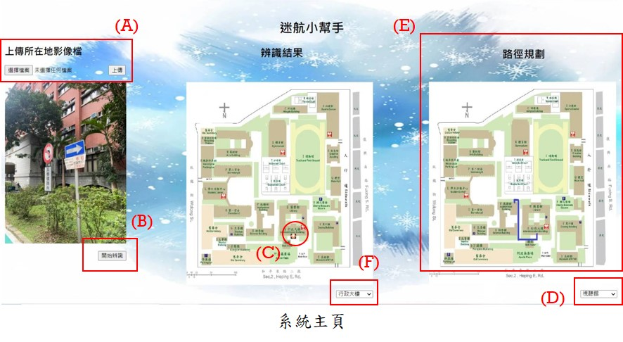
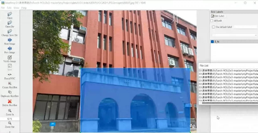
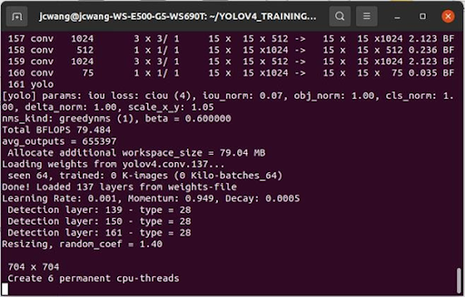
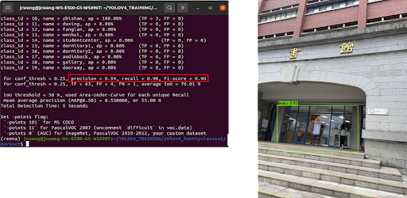
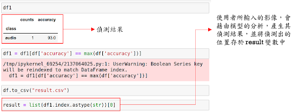
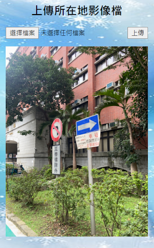
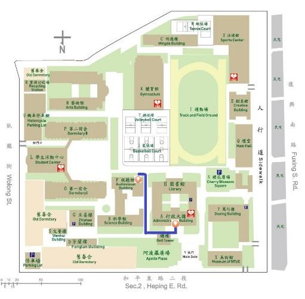

# Track-Helper-Detection-and-Navigation-of-Route-Panorama-System-based-on-YOLOV4
迷航小幫手—YOLOv4物件偵測與導航系統

## Abstract  
Most people go out instead of using traditional maps to view paths, but instead use satellite navigation for positioning and destination search. However, if the location range is too small (e.g. a school), the navigation system can only show which school the user is currently in, while they cannot determine which floor or building of the school.  

Therefore, we developed the "Trek Helper" system, which uses the self-photographed building images of the National University of Education as the main training dataset to solve the detailed position recognition that cannot be achieved by general satellite navigation. In this system. The user can open the lens to take pictures, achieve the purpose of determining the exact location, detect the user's current location. And after the user enters the destination requirements, the system will analyze and plan the route, give a clear travel route. Different from the traditional campus map or playground sightseeing guide map, this system is an extension of satellite navigation and the basis for future AI intelligent tour guides.  

1. **Introduction**  
In recent years, technology has become more and more developed, most people no longer use traditional maps to view the path when traveling, but instead use satellite navigation systems for positioning and purpose navigation. But for satellite navigation systems, if people's location range is too small (such as a school, an amusement park area), the navigation system would show more positioning results that can not clearly identify the user's exact location, and can only locate which school or which amusement park the user is currently in. At this time, it is not possible to tell which floor or building the user is on the school or amusement park.    
As a result of these reasons, most people will not be able to determine their exact location, and after arriving at the school or amusement park, they can only use a traditional campus map or sightseeing guide map to see their current location and determine how to get to their destination. When you are in a hurry or have a hurry, it is easy to be late because you don't know how to walk around the campus/amusement park.    
For the reasons above, we have developed a "Trek Helper System" based on the theme of environmental images of the campus of National Taipei University of Education, showing a system that can directly take pictures of the surrounding environment and solve the detailed position recognition that cannot be achieved by ordinary satellite navigation. In this system, the user can open the lens to take pictures to achieve the requirements of determining the exact position of the use. After detecting the user's current location, the system will also analyze the current location situation, route planning, and give a clear travel route after the user enters the needs of the purpose. Different from the traditional campus map or playground sightseeing guide map, **this system is an extension of satellite navigation and will be the the basis for the AI intelligent tour guides in the future**.  

2. **Introduction to System Functionality**  
In this system (as shown in Figure 1), the users can **determine their exact position** by opening the lens to take pictures. After detecting the user's current location, the system will also analyze the current location situation, carry out **route planning**, and give a clear travel route after the user enters the demand of the purpose.

**Illustration**:  
(A) Take a random photo at their location and upload an image.  
(B) Press the button, and the system performs position recognition.  
(C) The results are displayed on a campus map and the user's current location is indicated.  
(D) Select the destination location in the drop-down menu.  
(E) The system plans the route and displays the best route to travel.  
(F) If you want to plan your route directly, change your departure location directly.  

3. **Features**
The main purpose of this system is to **identify the street view of areas that cannot be clearly identified by satellite navigation, taking pictures of mobile devices to determine the user's current location.** In addition, the system also provides a **navigation** function, which allows users to automatically navigate through the selection of destination location through route planning technology, so as to help visitors in need to visit the campus more smoothly.

4. **Technical Skills**
    - Python
    - YOLOv4 Object Detection
    - OS: Windows, Linux/Ubuntu
    - Image Labeling
    - HTML / CSS / Javascript
    - Web frame: Flask

5. **Users**  
This system is mainly designed for visitors who are **not familiar with the campus of National Taipei University of Education**, including: new students, transfer students, on-campus visitors, visitors with official needs, etc.  

6. **Development Method**
Step.01  LabelImage  

Step.02  Model Training: the process is shown in the following figure

Step.03  Model Training Results and Tests

Step.04  Rrocess of Image Recognition

Step.05  Flask Runner (Simple)

Step.06  Flask: Web Image Upload

Step.07  Landmark and Route Navigation

7. **Conclusion**  
In this project, we used the images of the National Taipei University of Education as the main training data. However, in addition to be used as a campus identification and navigation system, this work can also use the same technology and different image data to **be applied in most amusement park areas in Taiwan**.  
Taking the research of this project team as the basis for subsequent application, this technical architecture can be applied to major domestic attractions such as Luofu Village, Jiu Ethnic Culture Village, Xitou Forest Recreation Area, etc. As the basis for AI guidance, when satellite navigation is "not so reliable", this technical architecture can be used for implementation: using the images of the amusement park/sightseeing spot as new training data, building models and implementing systems, so **it can solve most of the problems caused by poor satellite signals and positioning errors**.  
In the future, we also hope to continue in-depth research on the computer vision, deep learning and image processing technologies used in this system. Combined with the IoT, cloud computing, blockchain and other technologies, we can analyze object detection and image processing problems from a more professional perspective, conduct intelligent control and satellite detection research, which extends the system to more related applications.
