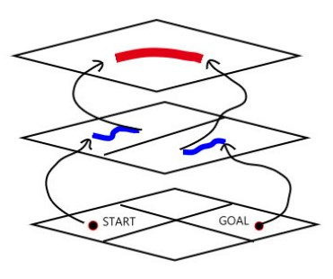

# Track-Helper-Detection-and-Navigation-of-Route-Panorama-System-based-on-YOLOV4
迷航小幫手—YOLOv4物件偵測與導航系統

## Abstract  
Most people go out instead of using traditional maps to view paths, but instead use satellite navigation for positioning and destination search. However, if the location range is too small (e.g. a school), the navigation system can only show which school the user is currently in, while they cannot determine which floor or building of the school.  

Therefore, we developed the "Trek Helper" system, which uses the self-photographed building images of the National University of Education as the main training dataset to solve the detailed position recognition that cannot be achieved by general satellite navigation. In this system. The user can open the lens to take pictures, achieve the purpose of determining the exact location, detect the user's current location. And after the user enters the destination requirements, the system will analyze and plan the route, give a clear travel route. Different from the traditional campus map or playground sightseeing guide map, this system is an extension of satellite navigation and the basis for future AI intelligent tour guides.  

1. **Introduction**  
In recent years, technology has become more and more developed, most people no longer use traditional maps to view the path when traveling, but instead use satellite navigation systems for positioning and purpose navigation. But for satellite navigation systems, if people's location range is too small (such as a school, an amusement park area), the navigation system would show more positioning results that can not clearly identify the user's exact location, and can only locate which school or which amusement park the user is currently in. At this time, it is not possible to tell which floor or building the user is on the school or amusement park.    
As a result of these reasons, most people will not be able to determine their exact location, and after arriving at the school or amusement park, they can only use a traditional campus map or sightseeing guide map to see their current location and determine how to get to their destination. When you are in a hurry or have a hurry, it is easy to be late because you don't know how to walk around the campus/amusement park.    
For the reasons above, we have developed a "Trek Helper System" based on the theme of environmental images of the campus of National Taipei University of Education, showing a system that can directly take pictures of the surrounding environment and solve the detailed position recognition that cannot be achieved by ordinary satellite navigation. In this system, the user can open the lens to take pictures to achieve the requirements of determining the exact position of the use. After detecting the user's current location, the system will also analyze the current location situation, route planning, and give a clear travel route after the user enters the needs of the purpose. Different from the traditional campus map or playground sightseeing guide map, this system is an extension of satellite navigation and will be the the basis for the AI intelligent tour guides in the future.  

2. Literature Review  
**2.1  Methods of Path Planning**  
*2.1.1  Two-Stage Path Planning*  
Two-Stage Path Planning is mainly to divide the path into different levels according to a certain method and then do planning, such as: national highways, provincial roads, county roads, etc. When planning, first find the higher level of the level path between the starting point and the end point, and then connect the original starting and ending points with the lower level of the stratum path, as shown in Figure 2.1.  
|  | 
|:--:| 
| *Figure 2.1* |
